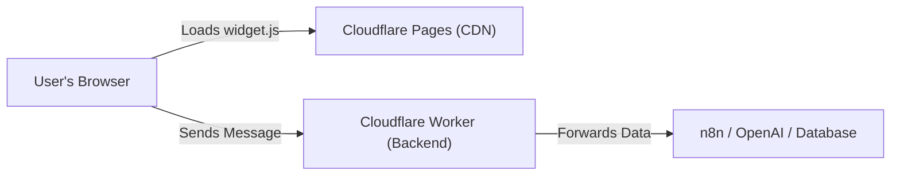

# 🚀 ChatPulse

**The Secure, Serverless Chat Widget for Modern Sites.**

Add AI-powered chat to your website in minutes using **Cloudflare Workers**. No servers to manage, no exposed API keys, and blazing fast performance at the edge.


---

## 📸 Screenshots

View the latest screenshots of the widget in the [screenshots/](screenshots/) directory.

---

## 🏗️ Architecture



1. **Frontend**: The user loads `widget.js` from a CDN (Cloudflare Pages).
2. **Security layer**: The widget talks *only* to your Cloudflare Worker.
3. **Backend**: The Worker acts as a secure proxy, adding keys/secrets and forwarding the request to your actual AI or automation backend (n8n, Zapier, etc).

---

## 📚 Step-by-Step Setup Guide

### Phase 1: The Backend (Cloudflare Worker) 🧠

This worker will be the secure "middleman" that protects your API keys.

1. **Log in** to [Cloudflare Dashboard](https://dash.cloudflare.com/).
2. Go to **Workers & Pages** → **Create Application** → **Create Worker**.
3. Name it `chatpulse-backend` and click **Deploy**.
4. Click **Edit Code**, delete everything, and paste this:

```javascript
export default {
  async fetch(request, env, ctx) {
    // 1. CORS: Allow your website to talk to this worker
    if (request.method === 'OPTIONS') {
      return new Response(null, {
        headers: {
          'Access-Control-Allow-Origin': '*', // Change to your specific domain in production
          'Access-Control-Allow-Methods': 'POST, OPTIONS',
          'Access-Control-Allow-Headers': 'Content-Type',
        },
      });
    }

    if (request.method !== 'POST') {
      return new Response('Method Not Allowed', { status: 405 });
    }

    try {
      const { message, sessionId } = await request.json();

      // --- YOUR LOGIC GOES HERE (Default: Echo Bot) ---
      const responseText = `You said: "${message}"`; 
      // ------------------------------------------------

      return new Response(JSON.stringify({ message: responseText }), {
        headers: {
          'Content-Type': 'application/json',
          'Access-Control-Allow-Origin': '*',
        },
      });
    } catch (error) {
      return new Response(JSON.stringify({ error: 'Server Error' }), { status: 500 });
    }
  },
};
```
5. **Deploy** and copy your Worker URL (e.g., `https://chatpulse-backend.your-subdomain.workers.dev`).

---

### Phase 2: The Frontend (Hosting the Widget) 🎨

You need to host `widget.js`, `widget.css`, and `avatar.png` so your website can load them. We recommend **Cloudflare Pages**.

1. Create a **new GitHub repository** (e.g., `chatpulse-cdn`).
2. Upload `widget.js`, `widget.css`, and `avatar.png` to it.
3. Go to **Cloudflare Dashboard** -> **Workers & Pages** -> **Create Application**.
4. Click **Pages** tab -> **Connect to Git** -> Select your new repo.
5. **Build Settings**: Leave everything blank/default.
6. Click **Save and Deploy**.

Cloudflare will give you a CDN URL (e.g., `https://chatpulse-cdn.pages.dev`).
Your assets are now available at:
- `https://chatpulse-cdn.pages.dev/widget.js`
- `https://chatpulse-cdn.pages.dev/widget.css`

---

### Phase 3: Embedding on Your Website 💻

Paste this code **before the closing `</body>` tag** of your website.

> ⚠️ **Important:** Replace the URLs below with YOUR actual CDN and Worker URLs from Phase 1 & 2.

```html
<!-- 1. Load Styles -->
<link rel="stylesheet" href="https://your-new-cdn.pages.dev/widget.css">

<!-- 2. Load the Widget Script -->
<script src="https://your-new-cdn.pages.dev/widget.js"></script>

<!-- 3. Configure & Initialize -->
<script>
    ChatWidget.config({
        // This is your Backend Worker (The Security Guard)
        webhookUrl: 'https://chatpulse-backend.your-subdomain.workers.dev', 
        
        welcomeMessage: 'Hi! How can I help you today?',
        primaryColor: '#F03E3E' 
    });
</script>
```

---

## 🔌 Connecting to AI or Workflows

Now that your worker is listening, connect it to something powerful!

<details>
<summary><strong>Option A: Connect to n8n / Zapier / Make (Click to Expand)</strong></summary>

Copy this into your Cloudflare Worker:

```javascript
// ... (inside try block)
const WEBHOOK_URL = 'https://n8n.your-domain.com/webhook/chatbot'; 

const webhookResponse = await fetch(WEBHOOK_URL, {
  method: 'POST',
  headers: { 'Content-Type': 'application/json' },
  body: JSON.stringify({ message, sessionId })
});

const data = await webhookResponse.json();
const responseText = data.output || data.message;
// ...
```
</details>

<details>
<summary><strong>Option B: Connect to OpenAI (ChatGPT) (Click to Expand)</strong></summary>

1. Set `OPENAI_API_KEY` in Worker Settings -> Variables.
2. Use this code:

```javascript
// ... (inside try block)
const aiResponse = await fetch('https://api.openai.com/v1/chat/completions', {
  method: 'POST',
  headers: {
    'Content-Type': 'application/json',
    'Authorization': `Bearer ${env.OPENAI_API_KEY}`
  },
  body: JSON.stringify({
    model: "gpt-4o-mini",
    messages: [{ role: "user", content: message }]
  })
});
// ...
```
</details>

---

## 🔒 Security: CORS Guide

If you see a "CORS Error" in your browser console, it means your Worker is blocking your website.

**Rule:** `Access-Control-Allow-Origin` should match the **website where the widget lives**.

**In your Worker Code:**
```javascript
headers: {
  // Allow ONLY your actual website
  'Access-Control-Allow-Origin': 'https://your-website.com', 
  // ...
}
```

---

## 🛠️ Customization

- **Avatar**: Replace `avatar.png` in your CDN repo with your own logo.
- **Colors**: Edit `widget.css` or pass `primaryColor` in the config object.
- **Text**: Customize the `welcomeMessage` in the embed code.

---

**Made with ❤️ for the Serverless Community**
