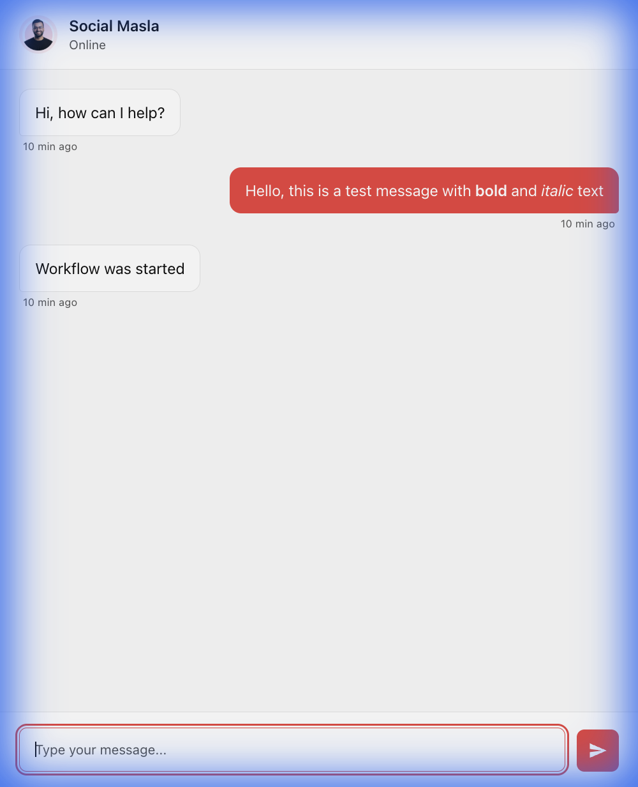

# 🚀 ChatPulse

**The Secure, Serverless Chat Widget for Modern Sites.**

Add AI-powered chat to your website in minutes using **Cloudflare Workers**. No servers to manage, no exposed API keys, and blazing fast performance at the edge.




---

## ⚡ Why Serverless?

- **🔒 Enhanced Security**: Keep your OpenAI/Anthropic API keys safe on the server-side (in Cloudflare Workers), never exposed in frontend code.
- **🚀 Edge Performance**: Your backend runs on Cloudflare's global network, ensuring low latency for users worldwide.
- **💰 Cost Effective**: Cloudflare Workers offers a generous free tier (100,000 requests/day).
- **📈 Infinite Scalability**: Automatically handles traffic spikes without managing servers.

---

## ✨ Features

- 🎨 **Modern Design** - Sleek, shadcn-inspired UI with smooth animations
- 🪶 **Ultra Lightweight** - <25KB minified + gzipped, zero dependencies
- 🔗 **Universal Compatibility** - Works with any backend, optimized for Cloudflare Workers
- 💾 **Message Persistence** - localStorage for conversation history
- 📝 **Full Markdown Support** - Bold, italic, code blocks, links, lists, tables
- 📱 **Fully Responsive** - Perfect on mobile and desktop
- ♿ **Accessible** - WCAG compliant

---

## ⚡ Serverless Configuration (Required)

ChatPulse requires a backend to handle messages securely. We recommend **Cloudflare Workers** (Free, fast, and secure).

### Option 1: The "5-Minute" Setup (No Code Tools)

1. **Log in** to [Cloudflare Dashboard](https://dash.cloudflare.com/).
2. Go to **Workers & Pages** → **Create Application** → **Create Worker**.
3. Name it `chatpulse-backend` and click **Deploy**.
4. Click **Edit Code**.
5. **Delete everything** and paste this exact code:

```javascript
export default {
  async fetch(request, env, ctx) {
    // 1. Handle CORS (Allow ChatPulse to talk to this worker)
    if (request.method === 'OPTIONS') {
      return new Response(null, {
        headers: {
          'Access-Control-Allow-Origin': '*', // Change to your domain in production
          'Access-Control-Allow-Methods': 'POST, OPTIONS',
          'Access-Control-Allow-Headers': 'Content-Type',
        },
      });
    }

    // 2. Only allow POST requests
    if (request.method !== 'POST') {
      return new Response('Method Not Allowed', { status: 405 });
    }

    // 3. Handle the Chat Logic
    try {
      const { message, sessionId } = await request.json();

      // --- YOUR AI LOGIC GOES HERE ---
      // Example: Simple Echo Bot
      // Replace this with your OpenAI / Anthropic API call
      const responseText = `You said: "${message}"`; 
      // -------------------------------

      return new Response(JSON.stringify({ message: responseText }), {
        headers: {
          'Content-Type': 'application/json',
          'Access-Control-Allow-Origin': '*',
        },
      });
    } catch (error) {
      return new Response(JSON.stringify({ error: 'Server Error' }), { status: 500 });
    }
  },
};
```

6. Click **Save and Deploy**.
7. Copy your **Worker URL** (e.g., `https://chatpulse-backend.your-name.workers.dev`).
8. Paste this URL into your `widget.js` config:

```javascript
ChatWidget.config({
    webhookUrl: 'https://chatpulse-backend.your-name.workers.dev', 
    // ...
});
```

### Option 2: Advanced Setup (CLI)

For developers who prefer command line, check out the [`examples/cloudflare-worker`](./examples/cloudflare-worker/) directory for a production-ready template using `wrangler`.

---

## 🔌 Connectivity Options

Here is the **Full Code** for the most common integrations. You can copy the entire block and replace your `worker.js` file content.

<details>
<summary><strong>Option A: Connect to n8n / Zapier / Make (Click to Expand)</strong></summary>

Copy this **entire code** into your Cloudflare Worker:

```javascript
export default {
  async fetch(request, env, ctx) {
    if (request.method === 'OPTIONS') {
      return new Response(null, {
        headers: {
          'Access-Control-Allow-Origin': '*',
          'Access-Control-Allow-Methods': 'POST, OPTIONS',
          'Access-Control-Allow-Headers': 'Content-Type',
        },
      });
    }

    if (request.method !== 'POST') return new Response('Method Not Allowed', { status: 405 });

    try {
      const { message, sessionId } = await request.json();

      // ↓↓↓ EDIT THIS URL ↓↓↓
      const WEBHOOK_URL = 'https://your-n8n-instance.com/webhook/chatbot'; 

      const webhookResponse = await fetch(WEBHOOK_URL, {
        method: 'POST',
        headers: { 'Content-Type': 'application/json' },
        body: JSON.stringify({ message, sessionId })
      });

          'Access-Control-Allow-Origin': '*',
        },
      });
    } catch (error) { ... }
```

---

## 💻 How to Embed on Your Website

To add ChatPulse to your site, simply paste the following code **before the closing `</body>` tag** of your website's HTML.

```html
<!-- 1. Load Styles -->
<link rel="stylesheet" href="https://your-cdn.com/widget.css">

<!-- 2. Load the Widget Script -->
<script src="https://your-cdn.com/widget.js"></script>

<!-- 3. Configure & Initialize (Add this right after the script) -->
<script>
    ChatWidget.config({
        webhookUrl: 'https://chatpulse-backend.your-subdomain.workers.dev', // ← Your Worker URL from above
        welcomeMessage: 'Hi! How can I help you today?',
        primaryColor: '#F03E3E'
    });
</script>
```

---

## 📖 Configuration

| Option | Description | Default |
|--------|-------------|---------|
| `webhookUrl` | URL of your Cloudflare Worker (or any endpoint) | Required |
| `welcomeMessage` | Initial greeting message | "Hi, how can I help?" |
| `primaryColor` | Accent color for buttons and user bubbles | `#F03E3E` |
| `maxRetries` | Retry attempts for failed requests | 3 |

---

## 🛠️ Customization

### Branding
- **Avatar**: Replace `avatar.png` with your own logo.
- **Colors**: Edit `widget.css` variables or pass `primaryColor` in config.
- **Header Text**: Edit the HTML structure in `widget.js` (or `widget.html` if using raw HTML).

### Backend Logic
Edit your Cloudflare Worker (`examples/cloudflare-worker/worker.js`) to change how the bot replies.
- Connect to **OpenAI** / **ChatGPT**
- Connect to **Anthropic Claude**
- Connect to **Supabase** or any database
- Trigger **n8n** or **Zapier** workflows securely

---

## 🔒 Security Best Practices

1. **Never** put API keys in your frontend HTML/JS.
2. Always use **Secrets** in Cloudflare Workers for keys (`wrangler secret put OPENAI_API_KEY`).
3. Configure **CORS** in your Worker to only allow requests from your specific domains in production.

---

## 📁 Project Structure

```
chatpulse/
├── examples/
│   └── cloudflare-worker/   # Serverless backend example
├── widget.js                # Core widget logic
├── widget.css               # Styling
├── embed.js                 # Loader script
├── demo.html                # Local testing page
├── avatar.png               # Default avatar
└── README.md                # Documentation
```

---

## 📄 License

MIT License. Free for personal and commercial use.

---

**Made with ❤️ for the Serverless Community**
